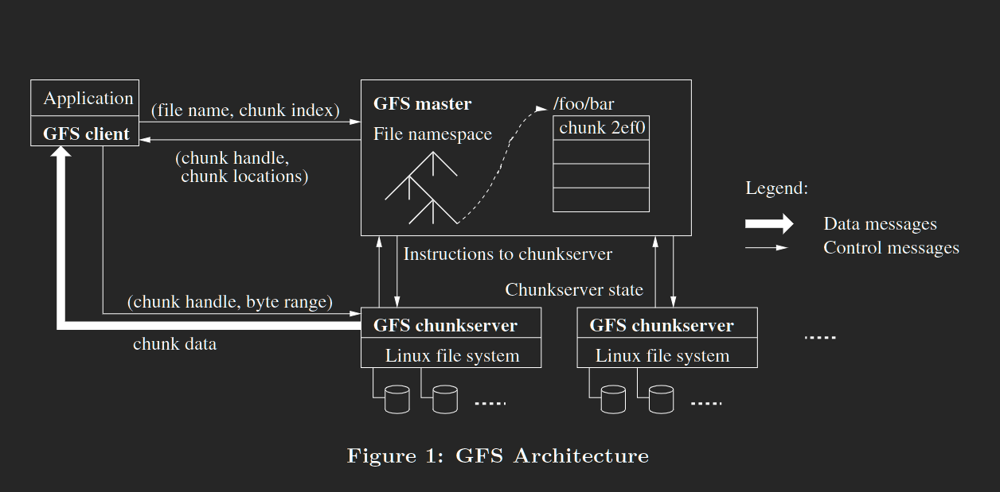

# The Google File System
# 摘要：
&ensp;&ensp;我们设计并实施了谷歌文件系统，一个可扩展的分布式的文件系统用于大型分布式数据密集型的应用程序，它在廉价的硬件上运行提供了容错。并且它为大量的客户端提供高性能。  
&ensp;&ensp;虽然与以前的分布式系统有很多目标重叠，我们的设计是由我们的应用程序工作负载和技术环境驱动的，这反映了一些早期文件系统设想的明显不同，导致了我们重新审视传统选择并探索截然不同的设计点。  
&ensp;&ensp;这个文件系统成功的满足了我们的存储需要，它作为我们的服务所使用的数据生成和处理以及需要大型数据库集合的研发工作的存储平台被广泛部署在谷歌内部。迄今为止最大的集群在超过1000台机器上的数千个磁盘上提供了数百TB的存储空间，并且由数百个客户端同时访问。  
&ensp;&ensp;在本文中，我们介绍了旨在支持分布式应用程序的文件系统接口的扩展，讨论了我们设计的许多方面，并报告了来自微基准和现实世界使用的测量结果。
# 1. 介绍：
&ensp;&ensp;我们设计并实施了GFS以满足google数据处理快速增长的需求，GFS与以前的分布式文件系统有着许多相同的目标，例如性能、可扩展性、可靠性、可用性。但是它的设计是由我们的应用程序工作负载和技术环境驱动的，这些观察结果反映了与一些早期文件系统的设计和假设有着显著的偏离，我们重新审视了传统的选择，探索了设计空间中截然不同的观点。  
&ensp;&ensp;首先，组件故障是常态而不是例外，文件系统考虑几百甚至是几千台由廉价的上也不见构建的存储机器组成，并由相当多数量的客户端访问，组件的数量和质量实际上保证了某些组件在任何给定的时间都无法正常工作，而有些组件无法从当前的故障中恢复。我们已经看到由应用程序错误、操作系统错误、人为错误以及磁盘、内存、连接器、网络和电源故障引起的问题。因此，持续的监控、错误检测、容错和自动恢复必须是系统的组成部分。  
&ensp;&ensp;其次，按照传统的标准，文件非常大，若干GB的文件很普遍，每个文件通常包含许多应用对象，比如网络文件。当我们经常处理由数十亿个对象组成的TB级且快速增长的数据集时，即使文件系统可以支持，也很难管理数十亿个大约KB大小的文件。因此必须重新审视设计设想和参数，如I/O操作和块大小。  
&ensp;&ensp;第三，大多数文件都是通过附加新数据而不是覆盖现有数据进行修改的，实际上文件中几乎不存在随机写入。一旦写入，文件就只能读取，而且通常只能顺序读取。各种数据都具有这些特性。有些可能构成数据分析程序扫描的大型数据库。有些可能是通过运行应用程序连续生成的数据流。有些可能是档案数据。有些可能是在一台机器上产生并在另一台机器上处理的中间结果，无论是同时还是稍后。考虑到这种对大型文件的访问模式，追加成为性能优化和原子性保证的焦点，而在客户端缓存数据块则失去了吸引力。  
&ensp;&ensp;第四。通过增加灵活性，共同设计应用程序和文件系统API有利于整个系统。例如我们放宽了GFS一致性模型，大大简化了文件系统，而不会给应用程序带来沉重的负担，我们还引入了一个原子追加操作，这样多个客户机可以同时追加到一个文件，而无需在他们之间进行额外的同步，这些将在后面进行更详细的讨论。  
&ensp;&ensp;目前为不同的目的部署了多个GFS集群，最大的有超过1000个存储节点，超过三百tb数据，并且被上百个客户端持续高频访问。  
# 2. 设计概览：
## 2.1 设想
&ensp;&ensp;在为我们的需求设计文件系统时，我们一直以提供挑战和机遇的假设为指导，我们之前提到了一些关键的观察结果，现在更详细的阐述我们的假设  
该系统由许多经常会发生故障的廉价商业组件构成。它必须持续监控自身，并定期检测、容忍组件故障，并及时从中恢复。  
* 该系统存储少了大文件，我们预计会有几百万个小文件，每个文件通常为100MB或者更大，若干GB是常见的情况，应该有效的进行管理，必须支持小文件，但我们不需要对他们进行优化。
* 工作负载主要包括两种读取，大型流式读取和小型随机读取。在大型流式读取中单个操作通常读取数百KB，更常见的是1MB或者更多，来自同一个客户端的联系操作通常读取文件的连续区域，一个小的随机读取通常以任意偏移量读取几KB，注重性能的应用程序通常对他们的小读取进行批处理和排序，以便在文件中稳定的前进，而不是来回跳跃移动。
* 工作负载也有许多文件追加的大型顺序写入，典型的操作大小与读取操作大小相似。一旦写入，文件很少在被修改。支持文件中任意位置的小写入，但不一定要高效。
* 系统必须为同时附加再同一个文件的许多客户端有效的实现定义良好的语义，我们的文件经常作为生产者消费者队列或多路合并。数百个生产者，每台机器运行一个，将同时追加到同一个文件中，具有最小同步开销的原子性是必不可少的。该文件很可能稍后会被读取，或者消费者可能正在同时读取该文件。
* 高持续的带宽比低延迟更重要，我们的大多数目标都是非常重视以高速率批量处理数据，而很少有人对单个读取或写入有严格的响应时间要求。

## 2.2 接口
&ensp;&ensp;GFS 提供一个熟悉的文件系统接口，尽管它没有实现像POSIX之类的标准API。文件在目录中分层组织并由路径名标识，我们支持创建、删除、打开、关闭、读取和写入这些文件的常规操作。  
&ensp;&ensp;而且 GFS 有快照和记录追加的操作，快照以低成本创建文件或目录树的副本。记录追加允许多个客户端同时向一个文件追加数据，同时保证每个客户端追加的原子性。它对于实现多路合并结果和生产者消费者队列很有用，许多客户端可以同时附加到这些队列，而无需额外的锁定，我们发现这些类型的文件对于构建大型分布式应用程序非常宝贵，快照和记录追加分别在第3.4节和3.3节中进一步讨论。  
## 2.3 架构
&ensp;&ensp;GFS集群是由一个master和多个chunkserver组成，被多个client访问。就像图1展现的那样，每一个通常都是允许用户级服务器进程的商品级linux机器。在同一台机器上同时运行chunkserver和client是很容易的，只要机器的资源允许并且能接受因为所运行的应用程序可能是不稳定而导致较低的可靠性。  
&ensp;&ensp;文件被分成固定大小的块，这些块由主节点在创建块时分配的固定且全局唯一的64位块柄标识。块服务器将块作为Linux文件存储在本地磁盘，并读取或写入由块句柄和字节范围指定的块数据。为了可靠性，每一个块都会在多个块服务器上复制。默认情况下，我们存储三个副本，尽管用户可以为文件命名空间的不同区域指定不同的复制级别。  
&ensp;&ensp;主服务器维护所有文件系统元数据。这包括命名空间、访问控制信息、从文件到块的映射以及块的当前位置。它还控制系统范围的活动，例如块租用管理、孤立块的垃圾回收以及块服务器之间的块迁移。主服务器通过HeartBeat消息与每个块服务器进行周期性的通信，为其提供指令并收集其状态。  
&ensp;&ensp;链接到每个应用程序的GFS客户端代码实现文件系统API，并与主服务器和块服务器通信以代表应用程序读取或写入数据。客户端与主服务器交互以进行元数据操作，但所有承载数据的通信都直接进入块服务器。我们不提供POSIX API，因此不需要挂钩到Linux vnode层  
&ensp;&ensp;客户端和服务器都不会缓存文件数据。客户端缓存几乎没有什么好处，因为大多数应用程序都是通过大型文件流传输的，或者工作集太大而无法缓存。没有它们可以通过消除缓存一致性问题来简化客户端和整个系统。（但是客户端会缓存元数据）块服务器不需要文件数据，因为块被存储为本地文件，因此Linux的缓冲区缓存已经将经常访问的数据保存在内存中。  
## 2.4 单个主节点

&ensp;&ensp;拥有一个master服务器极大的简化了我们的设计，并使master能够使用全局知识做出复杂的块放置和复制策略。但是我们必须尽量减少他在读写中的参与，以免它成为瓶颈。客户端从来不通过主服务器对文件进行读写，相反，客户端询问主服务器它应该联系哪些块服务器。它在一定的时间内缓存这些信息，并直接与块服务器交互以进行许多后续操作。  
&ensp;&ensp;让我们参照[图1](../resource/efd7a0e586376f4c332f3cbe4be55daf8995ef6949dc4daed3f2c0a00e86c87d.png)来解释简单的读取交互。首先，使用固定的块大小，客户端将应用程序指定的文件名和字节偏移量转换成文件内的块索引。接着，它向master服务器发送一个包含文件名和块索引的请求。主节点恢复相应的块句柄和副本的位置。客户端使用文件名和块索引作为键来缓存这些信息。  
&ensp;&ensp;然后客户端向其中一个副本发送请求，很可能是最近的一个。该请求指定块句柄和该块内的字节范围。在缓存信息过期或文件重新打开之前，对同一块的进一步读取不需要进行多次客户端与主节点交互。事实上，这些呼呼段通常会在一个请求中同时请求多个块，并且主节点还可以包括紧跟在请求之后的块的信息。这些额外的信息几乎无需额外成本就可以回避未来的几个客户端与主节点的交互。  
## 2.5 块大小
&ensp;&ensp;块大小是关键的设计参数之一，我们选择了64MB，这比典型的文件系统块大小大得多，每个块副本都存储为块服务器上的纯Linux文件，并且仅在需要时进行扩展。惰性空间分配避免了由于内部碎片而浪费空间。  
&ensp;&ensp;一个大尺寸的块提供了几个重要的优点。首先，它减少了客户端与主节点之间的交互需要，因为对同一个块的读写只需要向主节点发出一个初始请求以获取块的位置信息。这种减少对我们的工作负载尤为重要，因为应用程序主要是按顺序读写大文件。即使对于小的随机读取，客户端也可以轻松的缓存多TB工作集的所有块位置信息。其次，由于在大块上，客户端更有可能对给定块执行许多操作，它可以通过长时间保持与块服务器的持久TCP连接来减少网络开销。第三，它减少了主机上存储的元数据大小。这允许我们将元数据保存在内存中，这反过来由带来了我们将在 [2.6.1](#2.6.1-内存数据结构) 节中讨论的其他优势。  
&ensp;&ensp;另一方面，大尺寸的块，即使是惰性空间分配，也有它的缺点。一个小文件由少量的块组成，也许只有一个。如果许多客户端访问同一个文件，存储这些块的块服务器可能会成为热点。在现实情况中，热点并不是一个主要的问题，因为我们的应用程序大多是按照顺序读取的多个大型多块文件。  
&ensp;&ensp;然而，当批处理队列系统首次使用GFS时，热点确实出现了：可执行文件作为单块文件写入GFS，然后同时在数百台机器上启动。存储此可行性文件的少数块存储器被数百个同时的请求超载。我们通过以更高的复制因子存储此类可行性文件以及使用批处理队列系统错开应用程序启动时间来解决这个问题。一个潜在的长期解决方案是允许客户端在这种情况下从其他客户端读取数据。  
## 2.6 元数据
&ensp;&ensp;主节点存储三种主要类型的元数据：文件和块命名空间、文件到块的映射以及每个块的副本的位置。所有的元数据都保存在主节点的内存中。前两种类型（名称和文件到块的映射）也通过将突变记录到存储在本机本地磁盘上并在远程机器上复制的操作日志中来保持持久性。使用日志可以让我们简单、可靠的更新主节点状态，并在主节点崩溃的情况下不会出现不一致的风险。主节点不会持久存储区块位置信息。相反，它会在主节点启动时以及块服务器加入集群时访问每个块服务器询问其块的信息。  
### 2.6.1 内存数据结构
&ensp;&ensp;因为元数据存储在内存中，因此主节点操作很快，此外，主节点可以轻松高效地在后台定期扫描其整个状态。这种定期扫描用于实现块垃圾回收，当块服务器出现故障时重新复制，和块迁移以平衡负载和磁盘空间跨块服务器使用。第[4.3节]()和将进一步讨论这些活动。  
&ensp;&ensp;这种只使用内存的方法有一个潜在的问题，那就是块的数量以及整个系统的容量都受到主节点的内存大小的限制。在实际情况中这并不是一个严重的限制。主节点为每个64MB的块维护少于64字节的元数据。大多数块已满，因为大多数文件包含许多块，只有最后一个可能部分填充。同样，文件命名空间数据通常需要每个文件少于64个字节，因为它使用前缀压缩紧凑的存储文件名。  
&ensp;&ensp;如果需要支持更大的文件系统，向主服务器添加额外的内存的成本对于我们通过将元数据存储在内存中获得的简单性、可靠性、性能和灵活性来说是一个很小的代价。  
### 2.6.2 块位置
&ensp;&ensp;主服务器不会永久记录哪些块服务器具有给定块的副本。它只是在启动时轮询块服务器以获取该信息。此后，主节点可以保持自己处于最新状态，因为它所控制着所有块放置并使用常规的heartbeat消息监视块服务器状态。  
&ensp;&ensp;我们最初试图将块位置信息持久的保存在主节点上，但我们认为在启动时从块服务器请求数据要简单的多，之后定期请求数据。这消除了在块服务器加入和离开集群、更改名称、失败、重新启动等行为时保持主节点和块服务器同步的问题。在拥有数百台服务器的集群中，这些事情经常发生。  
&ensp;&ensp;理解这个设计决策的另一种方法是认识到块服务器对它是否在自己磁盘上有最终的决定权。  
### 2.6.3 操作日志
&ensp;&ensp;操作日志包含关键元数据更改的历史记录。它是GFS的核心。它不仅是元数据的唯一持久记录，而且还用作定义并发操作顺序的逻辑时间线。文件和块以及他们的版本（参见第[4.5节]()）,都由它们创建的逻辑时间唯一且永久的标识。  
&ensp;&ensp;由于操作日志很关键，我们必须可靠地存储它，并在元数据更改持久化之前不让更改对客户端所见。否则，即使块本身存活，我们实际上也会丢失整个文件系统或最近的客户端操作。因此我们将其复制到多台远程机器上，并且只有在将相应的日志记录刷新到本地和远程磁盘后才响应客户端操作。主节点再刷新之前将多个日志记录批处理在一起，从而减少了刷新和复制对整个系统吞吐量的影响。  
&ensp;&ensp;主节点通过重放操作日志来恢复其文件系统状态，为了使启动时间最小化，我们必须保持日志很小。每当日志增长超过一定大小是，主节点检查点都会检查其状态，这样它就可以通过从本地磁盘加载最新的检查点并在此之后仅重放有限数量的日志记录来恢复。检查点是一种紧凑的B树形式，可以直接映射到内存中，用于命名空间查找，而无需额外的解析。这进一步加快了恢复速度并提高了可用性。  
&ensp;&ensp;因为建立一个检查点可能需要一段时间，所以主节点内部状态的结构是这样的，既可以在不延迟传入突变的情况下创建一个新的检查点。主节点切换到一个新的日志文件并在一个单独的线程中创建新的检查点。新的检查点包括切换之前的所有的突变。对于有几百万个文件的集群，它可以在一分钟左右的时间内创建。完成后，它会在本地和远程写入磁盘。  
&ensp;&ensp;恢复只需要最新的完整检查点和后续日志文件。旧的检查点和日志文件可以自由删除，但我们保留一些以防止灾难发生。检查点期间的失败不会影响正确性，因为恢复代码会检测并跳过不完整的检查点。  
## 2.7 一致性模型
&ensp;&ensp;GFS有一个宽松的一致性模型，可以很好的支持我们高度分布式的应用程序，但实现起来仍然相对的简单和高效。我们现在讨论GFS的保证以及它们对应用程序的意义，我们还强调GFS如何维护这些保证，但将细节留给本文的其他部分。  

